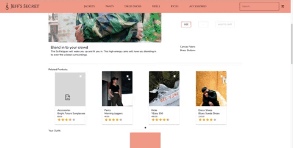

<br />
<p align="center">
  <h1 align="center">Project Catwalk</h1>

  <p align="center">
    A new product detail page for a mock fashion website, Jeff's Secret.
    <br />
    <h3 align="center">
     <strong>Contributers »</strong>
    <br />
    <br />
    <a href="https://github.com/itsme-sunil">Sunil Gadgil</a>
    ·
    <a href="https://github.com/ecruz4">Eric Cruz</a>
    ·
    <a href="https://github.com/cmcrow2">Cam Crow</a>
    ·
    <a href="https://github.com/jeff-try-code">Jeff Jiang</a>
     </h3>
  </p>
</p>

<!-- TABLE OF CONTENTS -->
<details open="open">
  <summary>Table of Contents</summary>
  <ol>
    <li>
      <a href="#about">About The Project</a>
      <ul>
        <li><a href="#stack">Built With</a></li>
      </ul>
    </li>
    <li><a href="#product-overview---sunil-gadgil">Overview</a></li>
    <li><a href="#related-products-and-outfit-lists---eric-cruz">Related Products and Outfit Lists</a></li>
    <li><a href="#questions-and-answers---cam-crow">Questions and Answers</a></li>
    <li><a href="#ratings-and-reviews---jeff-jiang">Ratings and Reviews</a></li>
    <li>
     <a href="#workflow">Workflow</a>
     <ul>
      <li><a href="#trello">Trello</a></li>
      <li><a href="#version-control">Version Control</a></li>
     </ul>
    </li>
    <li>
     <a href="#development">Development</a>
     <ul>
      <li><a href="#repo">Repo</a></li>
      <li><a href="#install">Install</a></li>
      <li><a href="#start-scripts">Start Scripts</a></li>
      <li><a href="#github-api-token">Github API token</a></li>
     </ul>
    </li>
  </ol>
</details>

# About
Our team of software engineers was tasked with building a product detail page for a mock fashion website, Jeff's Secret. We were given three weeks to implement our client's user story, laid out to us in a business document. The product detail page is comprised of four main widgets - further details can be found below.


# Stack

<table>
  <tbody>
    <tr>
      <th>Frontend Languages</th>
      <td>
        
         
         
      </td>
    </tr>
    <tr>
      <th>Frameworks & Libraries</th>
      <td>
        
        
        
      </td>
    </tr>
    <tr>
      <th>Utilities</th>
      <td>
        
        
        
        
        
      </td>
    </tr>
     <tr>
      <th>Workflow</th>
      <td>
        
        
        
        
        
      </td>
    </tr>
    <tr>
      <th>Deployment</th>
      <td>
        
      </td>
    </tr>
  </tbody>
</table>


## Header with Search bar --[Cam Crow](https://github.com/cmcrow2)
**Features:**

  * *Search Bar*: searches on change for products by product name or category - clicking the search bar renders a drop-down list of products to choose from


## Product Overview --[Sunil Gadgil](https://github.com/itsme-sunil)
**Features:**

  * *Product Information*: dynamically renders information such as product rating, category, name, and price
  * *Style Selector*: presents the user with all styles and has the ability to toggle between them
  * *Add to Cart*: includes a size selector, capable of handling an out of stock size, button will add the currently selected item to the cart
  * *Image Gallery*: displays photos specific to the currently selected style, and user can toggle an extended view on main image


## Related Products and Outfit Lists --[Eric Cruz](https://github.com/ecruz4)
**Related Products List Features:**

  * *Related Products List* dynamically renders a series of products related to the current product
  * *Product Card*: clicking on a related product card changes the current product
  * *Comparison Modal*: clicking the star icon displays feature comparison between current product and related product

**Custom Outfit List Features:**

  * *Add to Outfit Card*: clicking the 'plus' sign adds the current product to the user's outfit list
  * *'X' icon*: clicking the red 'X' removes the product from the list
  * *Outfit List*: persists upon page refresh

  


## Questions and Answers --[Cam Crow](https://github.com/cmcrow2)
**Features:**

  * *Search Bar*: allows a user to search for questions
  * *Questions and Answers List*: displays the questions and answers, sorted by helpfulness
  * *Helpfulness*: clicking 'Yes' adds one to the helpfulness quantity of a question or answer
  * *More Answered Questions Button*: displays more questions and answers
  * *Add Question/Add Answer*: pops up a dialog box that allows the user to add a question or answer

 


## Ratings and Reviews --[Jeff Jiang](https://github.com/jeff-try-code)
**Ratings Features:**

  * *Ratings Summary*: displays current average rating, as well as the rating breakdown by number of stars
  * *Product Breakdown*: displays user-provided feedback on product characteristics

**Reviews Features:**

  * *Reviews List*: clicking 'More Reviews' button displays two additional reviews
  * *Add a Review*: upon clicking, a form pops up to submit a new review

 


# Workflow
Our team used Agile workflow for this sprint.


## Trello
A Trello board was used to create and track tickets. We held daily standup meetings to discuss accomplishments, challenges, and upcoming tickets. We utilitized Discord, Slack, and Zoom in order to maintain effective remote collaboration and allow for quick communication when necessary.


## Version Control
We utilized Git Feature Branch workflow. All pull requests in Github were reviewed by another team member before being merged into the main branch.


# Development

## Repo
`git clone https://github.com/ht-atx55-team-timbre/project-catwalk.git`

## Install
`npm install`

## Start Scripts
```
npm run build
npm start
```

## Github API Token

To use the API, you must create a GitHub API Token and attach it in every request as an "Authorization" header.

To create a API token:

1. Go to: https://github.com/settings/tokens
2. Click "Generate new token"
3. Given the Token a Description
4. Under Select Scopes, select the following:
    * read:org
    * user
    * read:user
    * user:email
    * user:follow
5. Generate Token

Note that this token is only viewable once, at generation time. Make sure to copy it to a secure place and never check it into your git history.
